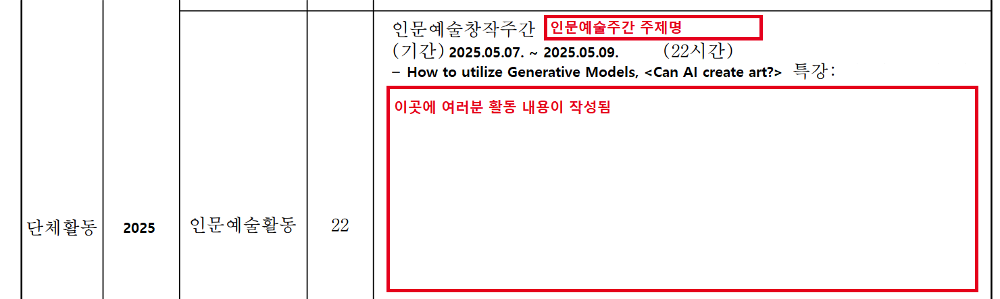

# 2025 세종과학예술영재학교 How to utilize Generative Models 강의 안내사항 (25.05.07.-05.09.)

Contact: Taewon Kang (강태원) (itschool [At] itsc [Dot] kr)

PhD Student @ University of Maryland (UMD, 메릴랜드 대학교), College Park (세종과학예술영재학교 3기 졸업생)

## 소감문(생활기록부) 작성 관련
* 다시한번 수고 많으셨습니다!

* 오지랖이긴 하지만, 전년도 몇몇 후배분들께서 이전에 수업 후 제게 개별적으로 질문하시기도 했고, 여러분들께 도움을 드리고자 몇 가지 SASA 선배의 시각에서 설명해드리고자 합니다.

* 아마 제 기억이 맞다면, 창의적 체험활동 내 인문예술활동 영역에 선생님들께서 여러분 소감문 내용을 기반으로 참고하여 생활기록부에 입력하실 것 같습니다! 중학교 생활기록부를 보신분들은 아마 아시겠지만, 네, 그 약간 전체 A4의 60% 되는 정도의 좁은 영역에 여러분들의 활동내용이 들어갑니다. 제가 재학중일 때 기준으로 SASA는 생활기록부 기재에 바이트수 제한도 별도로 없었기에 (일반고와 비교하면 엄청난 장점이죠?) 최대한 많은 내용을 소감문에 잘 녹여서 쓰시면 좋을 것 같습니다!

* 그리고 참고로 세종과학예술영재학교 학교생활기록부에는 아래처럼 들어갑니다. 제 생활기록부 예시사진을 첨부해드리니 참고하시면 좋을 것 같아요!

* 여러분이 **실험을 돌리면서 했던 시행착오들과 실험과정을** 강조하시면 좋을 것 같아요.
  * Generative Model에서 어떤 파라미터를 바꾸어보았는지?
  * 실험을 돌리며 결과가 잘 안나왔을때 어떤 부분을 개선했는지?
  * 음악선정과 스토리텔링은 어떻게 하셨는지?
  * 자신이 제작한 영상은 어떤 스토리를 담고 있는지?

* 특히 배운 내용 중 **짧은 시간 내에 어떻게 아이디어를 도출해서 Generative Model로 결과를 표현했는지** 설명도 쓰면 좋을 것 같고, 더 나아가서 **어떤 점을 배우고 느꼈는지** 작성해주시면 좋을 것 같아요.

* 생활기록부는 **여러분이 2년(혹은 1년) 뒤 치르게 될 대학입시에 정말 정말 중요** 합니다. [그 예시로 서울대학교는 2024년 수시 입학전형부터 자기소개서와 교사추천서를 받지 않습니다. (25페이지, 페이지수는 PDF 파일 기준)](https://admission.snu.ac.kr/undergraduate/early/guide)

**그럼 이제 대학입시에서 여러분을 평가할 수 있는 요소가 생활기록부밖에 없겠죠?**

선생님께서 생활기록부를 빠르고 정확하게 참고해서 쓰실 수 있도록 여러분께서 기한 맞춰서 충실히 소감문에 내용 기재해주시고, 
혹시라도 궁금한 사항이 있다면 언제든 제게 편하게 질문주세요. (이메일 (알고 계신다면 연락처로) 로 편하게 연락주시면 됩니다. 미국 시차에 맞추어 확인할 수 있습니다!)

## LICENSE
Awesome Tips를 포함한 본 실습자료 일체 무단전재와 복사, 배포, 상업적인 용도의 이용을 금지합니다.

## Reference
